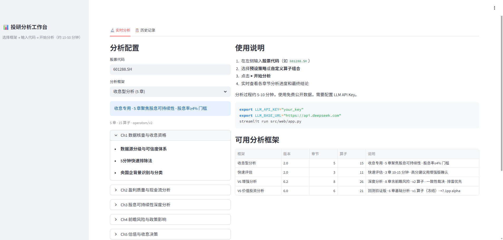
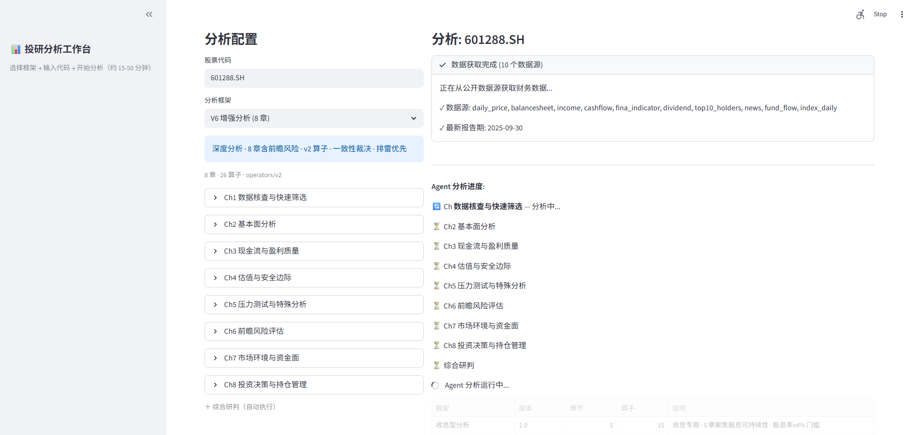
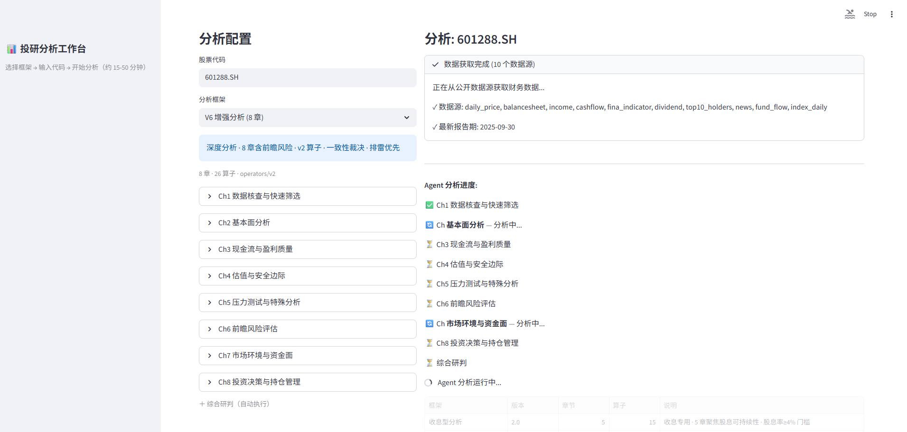
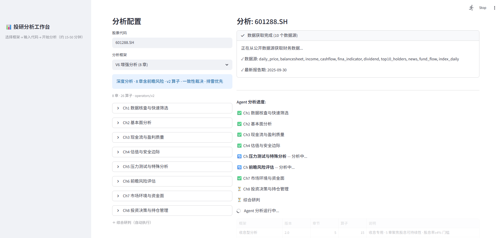
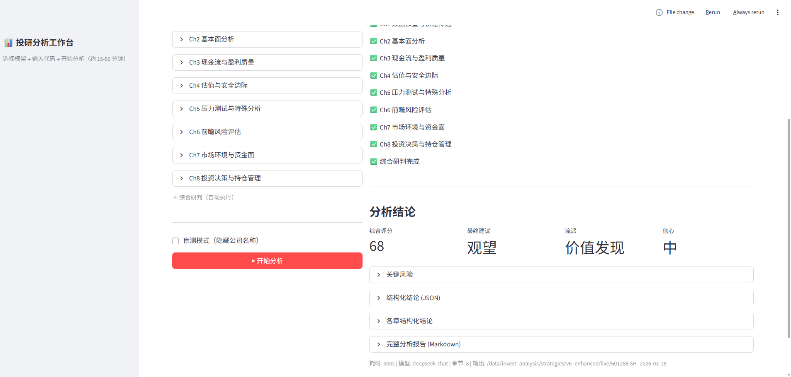
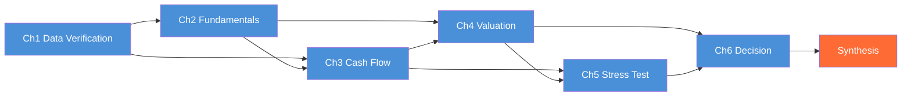

# Thesis Backtester — AI-Powered Investment Analysis Framework

> Markdown operators + DAG orchestration + LLM step-by-step reasoning + multi-baseline backtest validation

Encode investment analysis methodology as executable operators, orchestrate them into a DAG with dependencies, and let LLM execute chapter by chapter — each step builds on the conclusions of the previous one. Not free-form AI chat, but **structured analysis following your methodology**.

## Backtest Results: +7.1pp Alpha

120 stocks × 12 half-year cross-sections × 5 years (2020-2025), 5-baseline comparison:

| Baseline | Samples | 6M Return | Win Rate | vs CSI300 |
|----------|---------|----------|----------|-----------|
| CSI300 | 12 | +0.9% | 42% | — |
| Screen Pool | 600 | +4.0% | 53% | +3.0pp |
| **Agent Buy** | **43** | **+8.1%** | **65%** | **+7.1pp** |


```
CSI300          +0.9%
                  │ +3.0pp  screening alpha
Screen Pool     +4.0%
                  │ +4.1pp  Agent incremental alpha
Agent Buy       +8.1%    end-to-end alpha: +7.1pp
```

**Avoid signals are even stronger**: 73% of stocks the Agent flagged "avoid" subsequently declined. Risk avoidance alpha (-14.8pp) is 2.3x stock selection alpha (+6.4pp).

> [Full report](strategies/v6_value/backtest/backtest_report_20260316_1448.md) · [Structured data](strategies/v6_value/backtest/backtest_summary_20260316_1448.json) · [120 analysis reports](strategies/v6_value/backtest/agent_reports/)

## Live Analysis Workbench

```bash
# Single stock real-time analysis (free data, no Tushare needed)
python -m src.engine.launcher strategies/v6_enhanced/strategy.yaml live-analyze 601288.SH

# Web workbench
streamlit run src/web/app.py
```



<details>
<summary>View analysis process screenshots</summary>






</details>

4 preset frameworks:

| Framework | Chapters | Focus |
|-----------|----------|-------|
| V6 Value Investing | 6 | Backtest-validated (+7.1pp alpha) |
| **V6 Enhanced** | **8** | **Deep analysis + forward risk + consistency ruling** |
| Quick Scan | 3 | 10-15 min fast assessment |
| Income Focus | 5 | Dividend sustainability |

## Core Design

**Operator DAG orchestration > single prompt**: each step's conclusion flows into the next, producing measurably better results through chained reasoning.

```
strategy.yaml                    All-in-one config: screening + framework + scoring + LLM
       │
       ▼
┌─── Engine ──────────────────────────────────────────────────────┐
│  StrategyConfig · Launcher · OperatorRegistry · FactorRegistry  │
└──────┬──────────────┬───────────────────┬───────────────────────┘
       │              │                   │
  ┌────▼────┐   ┌─────▼──────┐   ┌───────▼────────┐
  │Screener │   │   Agent    │   │   Backtest      │
  │         │   │ 26 ops DAG │   │  Pipeline       │
  │         │   │ 3-layer    │   │ screen → agent  │
  └────┬────┘   │ scoring    │   │   → eval        │
       │        └─────┬──────┘   └───────┬────────┘
┌──────▼──────────────▼─────────────────▼───────────────────────┐
│  Data Layer: Provider abstraction · Parquet · Snapshot · API   │
└───────────────────────────────────────────────────────────────┘
```

| Design | Approach |
|--------|----------|
| **Operator-driven** | 26 `.md` operators, strategies compose via YAML, no code needed |
| **Blind testing** | Company names hidden to eliminate AI brand bias |
| **Time boundary** | Data layer filtering + prompt injection + tool sandbox |
| **3-layer scoring** | Thinking steps → scoring rubric → decision thresholds |
| **5-baseline comparison** | CSI300 / screen pool / top tier / Agent buy / Agent top5 |

<details>
<summary>Agent analysis flow (DAG dependency graph)</summary>



</details>

<details>
<summary>Backtest pipeline (3 independent steps)</summary>

```bash
python -m src.engine.launcher strategies/v6_value/strategy.yaml backtest-screen   # ① Screen (seconds)
python -m src.engine.launcher strategies/v6_value/strategy.yaml backtest-agent    # ② Agent (hours)
python -m src.engine.launcher strategies/v6_value/strategy.yaml backtest-eval     # ③ Evaluate (minutes)
```

Each step is independent — can be interrupted and resumed. Agent automatically skips completed analyses.

</details>

## Quick Start

```bash
pip install -e .
export LLM_API_KEY="your_key"
export LLM_BASE_URL="https://api.deepseek.com"

# Live analysis (free data, no Tushare needed)
python -m src.engine.launcher strategies/v6_enhanced/strategy.yaml live-analyze 601288.SH

# Or launch web workbench
streamlit run src/web/app.py
```

<details>
<summary>Backtest mode (requires Tushare)</summary>

```bash
export TUSHARE_TOKEN="your_token"

python -m src.engine.launcher data init-basic
python -m src.engine.launcher data init-market 2020-01-01
python -m src.engine.launcher strategies/v6_value/strategy.yaml backtest-screen
python -m src.engine.launcher strategies/v6_value/strategy.yaml backtest-agent
python -m src.engine.launcher strategies/v6_value/strategy.yaml backtest-eval
```

</details>

<details>
<summary>Create your own strategy</summary>

1. Create `strategies/<name>/strategy.yaml` (reference [v6_value](strategies/v6_value/strategy.yaml))
2. Define screening conditions (`screening`)
3. Compose operators into chapters (`framework.chapters`)
4. Run `backtest-screen` → `backtest-agent` → `backtest-eval`

No code required. Output schema auto-generated from operator `outputs` definitions.

</details>

<details>
<summary>Project structure</summary>

```
src/
├── engine/        # Engine: config + launcher + registries
├── data/          # Data: Provider + Parquet + snapshot + free crawler
├── agent/         # Agent: LLM analysis (DAG scheduling + tool_use)
├── screener/      # Screener: declarative quantitative filtering
├── backtest/      # Backtest: 3-step pipeline + 5-baseline eval
└── web/           # Web: Streamlit analysis workbench

operators/v1/      # Operator library v1 (21, frozen, tied to backtest results)
operators/v2/      # Operator library v2 (26, including forward risk operators)
strategies/        # Strategy instances (4 presets)
```

</details>

## Roadmap

| Timeline | Plan |
|----------|------|
| **2026 Q2** | Mock portfolio: full CSI300 Agent evaluation → Top 15 holdings → public release → year-end accountability |
| **2026 H2** | 3-layer production: earnings-driven analysis (quarterly) + price monitoring (daily) + news verification (on-trigger) |
| **Ongoing** | Operator refinement · sample expansion (120 → 500+) · multi-strategy comparison |

Tech directions:
- Engine-level gate enforcement (currently declarative only)
- Same-day result caching
- Multi-LLM comparison (DeepSeek / GPT / Claude)
- More free data sources (full announcements, research report summaries)

## Docs

- [Architecture](docs/design/architecture.md) · [Agent](docs/design/agent.md) · [Data Layer](docs/design/data_layer.md) · [Operators](docs/design/operators.md) · [Screener](docs/design/screener.md) · [Backtest](docs/design/backtest.md) · [Scoring](docs/design/scoring.md) · [Live Analysis](docs/design/live_analysis.md)

## License

Apache License 2.0

## Disclaimer

This tool is for **investment methodology research and validation only**. It does not constitute investment advice. Past backtest results do not guarantee future performance.

---

[中文文档](README.md)
